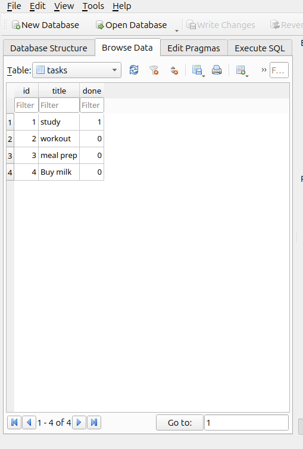
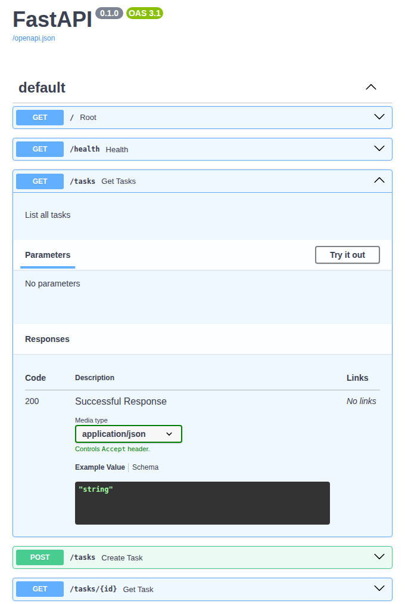

# To-Do CRUD API

A small FastAPI app that manages a to-do list — create, read, update and delete tasks. Built for the FlyRank Backend Track internship. Week 2 had it running on an in-memory list, week 3 moved it to a real SQLite database, so data now survives a restart.

## Tech Stack

- **Framework:** FastAPI
- **Database:** SQLite (`tasks.db`), via Python's built-in `sqlite3`
- **Validation:** Pydantic
- **Docs:** Swagger UI (built in)

## Why SQLite

No server to install, no config — it's just one file. Good fit for a small project like this, and it means the data actually survives a restart now, instead of resetting every time.

## Local Setup

```bash
git clone https://github.com/Hussaan-dev/todo_crud_api.git
cd todo_crud_api
python -m venv venv
source venv/bin/activate
pip install fastapi uvicorn
uvicorn main:app --reload
```

`tasks.db` gets created automatically on first run, with 3 example tasks seeded in. It's gitignored, so every fresh clone starts clean.

Visit `http://localhost:8000/docs` for the interactive Swagger UI.

## Endpoints

| Method | Path | Description |
|--------|------|-------------|
| GET | `/` | API info |
| GET | `/health` | Health check |
| GET | `/tasks` | List all tasks |
| GET | `/tasks/{id}` | Get one task |
| POST | `/tasks` | Create a task |
| PUT | `/tasks/{id}` | Update a task's title and/or done status |
| DELETE | `/tasks/{id}` | Delete a task |

## Example

```bash
curl -i http://localhost:8000/tasks
```
```
HTTP/1.1 200 OK
content-type: application/json

[{"id":1,"title":"study","done":true},{"id":2,"title":"workout","done":false},{"id":3,"title":"meal prep","done":false}]
```

## Poking the database directly

Opened `tasks.db` in DB Browser for SQLite and ran some queries by hand, outside the API. Ran `SELECT COUNT(*) FROM tasks;` and it matched exactly what `GET /tasks` was showing. Then changed a task's `done` value straight in DB Browser, saved it, and called `GET /tasks/{id}` — no restart needed, it just showed the new value immediately. Same file, no syncing.



## Swagger UI



## What I Learned

- SQLite objects can't be shared across threads by default — FastAPI runs requests on different threads, so I needed `check_same_thread=False` on the connection
- `INTEGER PRIMARY KEY` means the database hands out ids for you — no need to track the next id myself anymore
- After an INSERT, `cursor.lastrowid` tells you the id SQLite just assigned
- Rows come back as plain tuples, not dicts — had to write a small helper to convert them into the JSON shape the API returns
- Always re-fetch from the database after an UPDATE before returning a response, instead of returning stale data from before the update ran

## What's Left

- Query parameter filtering (`?done=true`, `?search=milk`)
- A `/stats` endpoint